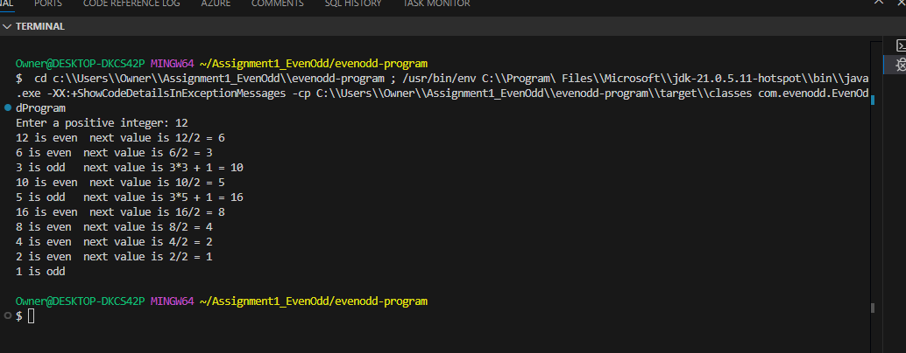

# Even-Odd Sequence Generator

A Java program that generates a sequence of numbers and identifies whether each number is even or odd, showing the calculation for the next number in the sequence.

## Class Descriptions

### [EvenOddProgram.java](src/main/java/com/evenodd/EvenOddProgram.java)
- Main entry point of the application
- Handles program flow and execution
- Contains the main loop for sequence generation

### [SequenceStep.java](src/main/java/com/evenodd/SequenceStep.java)
- Represents a single step in the sequence
- Stores number, even/odd status, and next value
- Formats the output string for each step

### [SequenceGenerator.java](src/main/java/com/evenodd/SequenceGenerator.java)
- Generates the sequence based on the input number
- Implements the sequence logic:
  - If even: n/2
  - If odd: 3n + 1

### [UserInterface.java](src/main/java/com/evenodd/UserInterface.java)
- Handles user input and output
- Manages console interaction
- Displays sequence results

## Sample Output



```

```

## How to Run

```bash
mvn clean install
mvn exec:java -Dexec.mainClass="com.evenodd.EvenOddProgram"
```

## Project Structure

```
evenodd-program/
├── pom.xml
├── README.md
└── src/
    └── main/
        └── java/
            └── com/
                └── evenodd/
                    ├── EvenOddProgram.java
                    ├── SequenceStep.java
                    ├── SequenceGenerator.java
                    └── UserInterface.java
```
````
